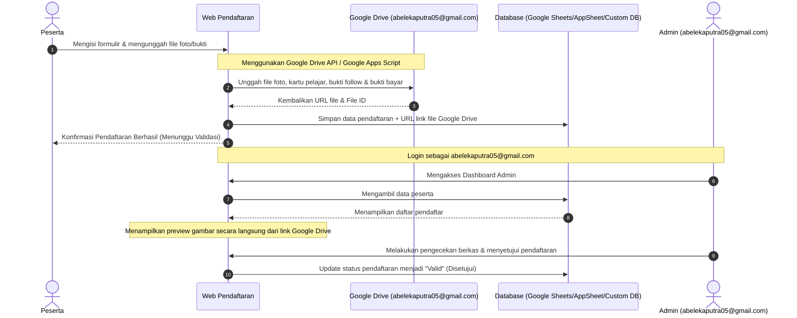

# Pengaturan Developer & Alur Sistem Pendaftaran
## Battle of Champions (BoC) 2026

Dokumen ini menjelaskan konfigurasi lingkungan (Environment Variables) dan alur sistem untuk penyimpanan berkas serta validasi pendaftaran peserta oleh Admin.

---

## 🛠️ Konfigurasi Environment Variables (.env)

Gunakan konfigurasi berikut pada file `.env` di server/aplikasi:

```env
# Email Utama Admin (untuk hak akses Dashboard Admin)
ADMIN_EMAIL="abelekaputra05@gmail.com"

# Konfigurasi Google Drive API / Service Account
# (Tempat semua file foto/bukti pendaftaran diunggah dan disimpan)
GOOGLE_DRIVE_DEVELOPER_EMAIL="abelekaputra05@gmail.com"
GOOGLE_DRIVE_FOLDER_ID="ID_FOLDER_GOOGLE_DRIVE_UNTUK_PENYIMPANAN"
```

---

## 🔄 Alur Sistem (Flowchart & Mekanisme)



### 1. Pendaftaran oleh Peserta
*   Peserta mengakses halaman pendaftaran dan mengisi semua data yang diminta (sesuai dokumen `daftar form input.md`).
*   Semua inputan file (Foto Ketua/Anggota, Kartu Pelajar, Bukti Follow Instagram, dan Bukti Pembayaran) akan diunggah secara otomatis ke **Google Drive** milik akun developer: `abelekaputra05@gmail.com`.
*   Aplikasi akan mendapatkan link URL akses langsung (view link) dari Google Drive untuk setiap file yang diunggah.

### 2. Dashboard & Hak Akses Admin
*   Akun email `abelekaputra05@gmail.com` didaftarkan di file `.env` sebagai **Admin**.
*   Ketika pengguna masuk (login) menggunakan email tersebut, sistem akan memberikan akses khusus untuk masuk ke **Dashboard Admin**.

### 3. Pengecekan & Validasi Berkas oleh Admin
*   Di dalam Dashboard Admin, seluruh data peserta yang masuk akan ditampilkan dalam bentuk tabel/dashboard.
*   File gambar/foto yang disimpan di Google Drive developer akan ditampilkan sebagai gambar/preview langsung (embed/image preview) pada dashboard sehingga Admin tidak perlu mengunduh file satu per satu.
*   Admin dapat melakukan pengecekan keselarasan berkas.
*   Jika semua berkas sesuai, Admin dapat menekan tombol **Setujui** yang akan mengubah status pendaftaran peserta tersebut menjadi **"Valid"**.
